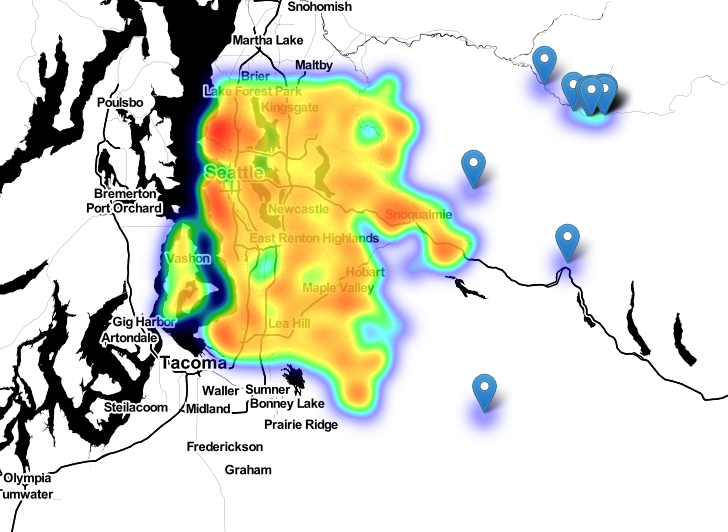

# Kings County Housing Price Project

**Author**: Justin Williams

## Overview

The goal of this project was to create a linear regression model that would accurately predict housing prices in Kings County, Washington. A years worth of data  spanning from 5/2/2014 - 5/27/2015 was provided. An extensive exploratory data analysis was conducted, reviewing descriptive statistics and creating visualations to better understand linearity assumptions and data distributions. Statistical tests for significance were conducted, and a number of features were engineered. Through application of a linear regression, and various feature selection techniques, a model was retained that accurately predicts housing prices on test data for Kings County Washington with a $210k margin of error.

## Business Problem

Summary of the business problem you are trying to solve, and the data questions that you plan to answer in order to solve them.

 This project's goal was to develop a model that accurately predicts housing prices in Kings County, Washington. This model can subsequently be used by many constituents within the real estate industry. Agents and brokers will be able to utilize their doman specific knowledge as well as this model, to predict trends in housing prcies. This will give them a data-driven model to predict housing prices, along with their hunches and domain specifc knowledge. Additionally, homebuyers and sellers, could use this to to help assist with the deciion making process on when to buy or sell a home. 

 That being said, the data questions to answer include:
 * What attributes contribute to higher housing prices, and of those which has a greater effect?
 * Given those attributes, which have a greater effect on housing prices?
 * 

***
Questions to consider:
* What are the business's pain points related to this project?
* How did you pick the data analysis question(s) that you did?
* Why are these questions important from a business perspective?
***

## Data

Describe the data being used for this project.

***
Questions to consider:
* Where did the data come from, and how do they relate to the data analysis questions?
* What do the data represent? Who is in the sample and what variables are included?
* What is the target variable?
* What are the properties of the variables you intend to use?
***

## Methods

Describe the process for analyzing or modeling the data. For Phase 1, this will be descriptive analysis.

***
Questions to consider:
* How did you prepare, analyze or model the data?
* Why is this approach appropriate given the data and the business problem?
***

## Results

Present your key results. For Phase 1, this will be findings from your descriptive analysis.

***
Questions to consider:
* How do you interpret the results?
* How confident are you that your results would generalize beyond the data you have?
***

Heat map of housing dispersion with longitudinal outliers in dataset:

### Visual 1


## Conclusions

Provide your conclusions about the work you've done, including any limitations or next steps.

***
Questions to consider:
* What would you recommend the business do as a result of this work?
* What are some reasons why your analysis might not fully solve the business problem?
* What else could you do in the future to improve this project?
***

## For More Information

Please review full analysis in the following [Jupyter Notebook](./Kings_County_Housing_Data_Project.ipynb).

For any additional questions, please contact **Justin Williams, justinmorganwilliams@newschool.edu**

## Repository Structure

Structure of repository and its contents:

```
├── README.md                                 <- The top-level README for reviewers of this project
├── Kings_County_Housing_Data_Project.ipynb   <- Narrative documentation of analysis in Jupyter notebook
├── notebooks                                 <- Folder with scrap notebooks used
├── data                                      <- Both sourced externally and generated from code
├── model.pickle                              <- Pickled linear regression model
└── images                                    <- Generated from code
```
