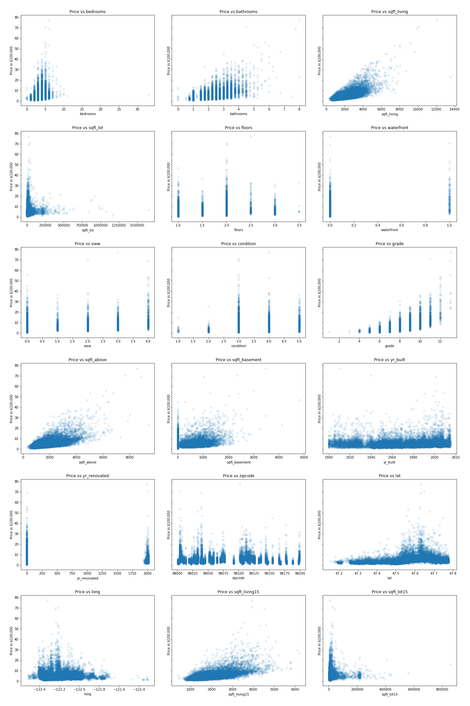

# Kings County Housing Price Project

**Author**: Justin Williams

## Overview

The goal of this project was to create a linear regression model that would accurately predict housing prices in Kings County, Washington. A years worth of data  spanning from 5/2/2014 - 5/27/2015 was provided. An extensive exploratory data analysis was conducted, reviewing descriptive statistics and creating visualations to better understand linearity assumptions and data distributions. Statistical tests for significance were conducted, and a number of features were engineered. Through application of a linear regression, and various feature selection techniques, a model was retained that accurately predicts housing prices on test data for Kings County Washington with a $210k margin of error.

## Business Problem

This project's goal was to develop a model that accurately predicts housing prices in Kings County, Washington. This model can subsequently be used by many constituents within the real estate industry. Agents and brokers will be able to utilize their doman specific knowledge as well as this model, to predict trends in housing prcies. This will give them a data-driven model to predict housing prices, along with their hunches and domain specifc knowledge. Additionally, homebuyers and sellers, could use this to to help assist with the decision making process on when to buy or sell a home. 

That being said, the main question was:
* _What attributes of the data contributed to higher housing prices, and which of those had a greater effect?_

Once the aforementioed was answered, features could be included and engineered that would best contribute to the models ability to predict housing prices. 

## Data

The data being used for this project provdied various attributes for homes that had sold from 5/2/2014 - 5/27/2015. The `price` target variable was included, which allowed comparision of relationships between the various attributes and the target. 

The data schema is as follows:

### Column Names and descriptions for Kings County Data Set
* **id** - unique ID for a house
* **date** - Date day house was sold
* **price** - Price is prediction target
* **bedrooms** - Number of bedrooms
* **bathrooms** - Number of bathrooms
* **sqft_living** - square footage of the home
* **sqft_lot** - square footage of the lot
* **floors** - Total floors (levels) in house
* **waterfront** - Whether house has a view to a waterfront
* **view** - Number of times house has been viewed
* **condition** - How good the condition is (overall)
* **grade** - overall grade given to the housing unit, based on King County grading system
* **sqft_above** - square footage of house (apart from basement)
* **sqft_basement** - square footage of the basement
* **yr_built** - Year when house was built
* **yr_renovated** - Year when house was renovated
* **zipcode** - zip code in which house is located
* **lat** - Latitude coordinate
* **long** - Longitude coordinate
* **sqft_living15** - The square footage of interior housing living space for the nearest 15 neighbors
* **sqft_lot15** - The square footage of the land lots of the nearest 15 neighbors

Primarily consideration was given to obvious indicators such as, total square feet, amount of bedrooms and location. However, through exploratory data anlysis and other methodologies, additional factors proved to be salient price indicators. 

## Methods

The exploratory data analysis (EDA) began with basic descriptive statistics such as,; mean, median, interquartile range, min and max. These were subsequently visualized through scatterplots to understand linear relatinships with the target varialbe `price`. Histrograms were created to look at distributions of data and aid in outlier identification. Outliers were handled on a case by case basis through descriptive statistics interpretation where appropiate. Once basic data cleaning was done, some statistical tests were administered to get a better understanding of the significance of assumptions made during the EDA process. 

Statistical tests for significance prompted various features to be engineered, for example: _if a house was built before the median of years houses were built, and has NOT received a renovation, was the mean/median `price` of said house significantly different then houses that received renovations?_. Engineered features such as the aforementioned, allowed patterns to be discovered within the data that are not initially discoverable.  After feature engineering, the data was split to create a training/test set, which enables the model to be fit to a subset of the data. Once this was fit, the model was run on the training and test set respectively. The lack of significant difference between output of train and test split allowed for the assumption of a model that was not overfit. A few different feature selection techniques were administered to see if altering feature selection would have a positive impact on the model. The best model included all features from analysis and was subsequently fit to the entire data set and saved for future use. 

## Results

Some results came out as expected. For instance, total square feet of living space, number of bedrooms and location had a high influence on price. However, other aspects that initially did not seem as important proved strong price indicators. For instance, view proved to be an important indicator, and not solely how high the grade was within the scoring system, but more simply did the house have a view at all or not. Grade which was the overall grade given to the housing unit, based on King County grading system, was a strong indicator of price. This was more of an aggreagate of multiple aspects of each home, however if grade scored well it was a more effecient indcator. 

### Relatiionships to target variable of price


* Clusters of points around the regression line indicates how strong the relationship of that particular variable is to the target `price`
* Points aligned in columns indicates a grading system like `view` and `grade`.

### Geographic outliers


* Shows dispersion of houses within the dataset
* Points on map to the east indicate homes where the mean price was 50% less then the main aggregate to the west

## Conclusions


A combination of many of the datapoints and engineered features where used to devleop this model. It predicts housing prices with a ~$210k margin of error. For next steps I would like to complete a more thorough geospatial analysis subsetting for various indicators utilizing promixation to amenities such as public transit, schools, and othe places of interest. This could help minimize the error and provide a more accurate predictive model.

***
## For More Information

Please review full analysis in the following [Jupyter Notebook](./Kings_County_Housing_Data_Project.ipynb).

For any additional questions, please contact: **Justin Williams, justinmorganwilliams@newschool.edu**

## Repository Structure

Structure of repository and its contents:

```
├── README.md                                 <- The top-level README for reviewers of this project
├── Kings_County_Housing_Data_Project.ipynb   <- Narrative documentation of analysis in Jupyter notebook
├── notebooks                                 <- Folder with scrap notebooks used
├── data                                      <- Both sourced externally and generated from code
├── model.pickle                              <- Pickled linear regression model
└── images                                    <- Generated from code
```
